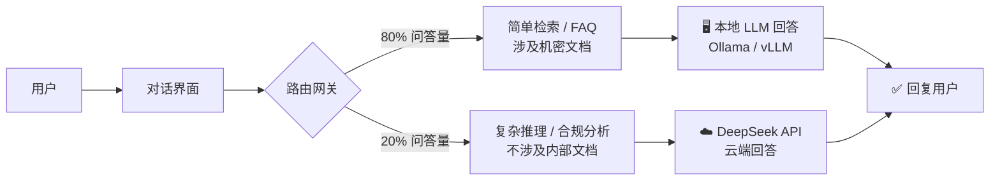
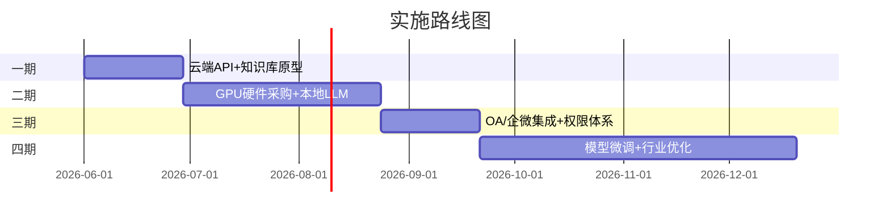

# 企业智能问答系统选型分析

## 目 录

1. 建设背景与方案总览
2. 国内主流云端平台对比
3. 完全本地自建方案
4. 模型选型与量化影响
5. 本地 vs 云端效果差距
6. 总成本对比分析（3年TCO）
7. 推荐方案：混合路由架构
8. 系统集成与实施路线
9. 风险提示与总结

---

# 术语表

| 术语/缩写 | 全称 | 说明 |
| :--- | :--- | :--- |
| LLM | Large Language Model | 大语言模型，如 DeepSeek、GPT、文心一言等 |
| RAG | Retrieval-Augmented Generation | 检索增强生成：外挂知识库 + LLM 的问答范式 |
| Embedding | — | 向量化，将文本转为数值向量的技术 |
| Reranker | — | 重排序模型，对粗检结果做精细排序 |
| MoE | Mixture of Experts | 混合专家架构，DeepSeek-V3 等采用的稀疏模型架构 |
| INT4 / INT8 | — | 模型量化精度，数字越小显存占用越少但精度损失越大 |
| Token | — | LLM 处理文本的最小单位，粗略 1 汉字 ≈ 1.5 tokens |
| TCO | Total Cost of Ownership | 总拥有成本，含硬件、软件、运维全生命周期费用 |
| SaaS | Software as a Service | 云端软件服务，按需付费使用 |
| GPU | Graphics Processing Unit | 图形处理器，LLM 推理的核心硬件 |
| vLLM | — | 高性能 LLM 推理引擎 |
| Ollama | — | 本地 LLM 一键部署工具 |

---

# 一、建设目标

### 核心目标

为企业搭建基于 **大语言模型（LLM）** 的本地知识库 + 智能问答系统

### 关键诉求

- 内部文档智能检索与问答
- 资料聚合和报告整理
- 研发数据安全保密
- 提升工作效率

---

# 四种方案路线

**A. 全云端 SaaS**
- 百度千帆 / 阿里百炼 等
- 零运维，开箱即用
- 数据上传至第三方

**B. 全本地自建**
- GPU服务器 + 开源模型
- 数据不出内网
- 完全自主可控

**C. 本地RAG + 云端API**
- 文档留存本地
- 推理调用云端
- 折中安全方案

**D. 混合路由（推荐）**
- 80% 走本地模型
- 20% 复杂问题走云
- 性价比最优解

---

# 二、国内主流SaaS平台

| 维度 | 百度千帆 | 阿里百炼 | 腾讯混元 | 火山方舟 |
|------|:---:|:---:|:---:|:---:|
| **模型能力** | ★★★★ | ★★★★★ | ★★★★ | ★★★★ |
| **平台成熟度** | ★★★★★ | ★★★★ | ★★★ | ★★★★ |
| **知识库能力** | ★★★★ | ★★★★ | ★★★★ | ★★★ |
| **Agent/工作流** | ★★★ | ★★★★ | ★★★ | ★★★★★ |
| **生态集成** | 百度云生态 | 阿里云+钉钉 | 腾讯+企业微信 | 飞书+抖音 |
| **开源可私有化** | 否 | Qwen系列开源 | 否 | 否 |
| **价格竞争力** | ★★★ | ★★★ | ★★★ | ★★★★ |

---

# SaaS平台定价参考

<small>单位：元/百万 tokens（2025年参考）</small>

| 平台 | 入口级模型 | 旗舰模型 | Embedding |
|------|:---:|:---:|:---:|
| 百度千帆 | ERNIE-Speed ¥0 | ERNIE 4.0 ¥120 | ¥0.7 |
| 阿里百炼 | qwen-turbo ¥0.3 | qwen-max ¥20 | ¥0.7 |
| 腾讯混元 | hunyuan-lite ¥0 | hunyuan-pro ¥15 | ¥0.7 |
| 火山方舟 | doubao-lite ¥0.3 | doubao-pro ¥2 | ¥0.7 |
| **DeepSeek（参照）** | **V3 ¥1** | **R1 ¥4** | **¥0.1** |

- DeepSeek 价格约为其它旗舰级模型的 1%-3%

---

# 云端SaaS方案：优劣势

优势

<v-clicks>

- 零运维，注册即用
- 模型能力极强（文心/通义/DeepSeek）
- 弹性扩展，秒级扩容
- 快速迭代，持续升级

</v-clicks>

劣势

<v-clicks>

- 数据上传第三方，合规风险高
- 持续API费用不可控
- 供应商锁定，难以迁移
- 底层检索/分块策略无法调优

</v-clicks>

---

# 三、本地硬件方案一览

| 方案 | GPU | 显存 | 成本(¥) | 并发 | 适用场景 |
|:---|:---|:---:|---:|:---|:---|
| 消费级 | 2×RTX 4090 | 48G | 40k-58k | 3-5人 | 小团队/试点 |
| 企业级 | 2×L40S | 96G | 110k-160k | 10-30人 | 正式生产 |
| 企业级 | 1×A100 | 80G | 110k-170k | 10-30人 | 受出口管制 |
| 工作站 | Mac Studio M2U | 192G统一 | 55k | 3-5人 | 安静/省电 |
| 信创 | 华为昇腾910B | 64G | 85k-160k | 5-15人 | 信创合规 |

---

# 本地可部署模型选型

| 模型 | 参数 | 架构 | FP16 | INT8 | INT4 | 中文 | 推理 |
|------|:---:|------|:---:|:---:|:---:|:---:|:---:|
| Qwen2.5-14B | 14B | 稠密 | 28G | 14G | 7G | ★★★★ | ★★★ |
| **Qwen2.5-32B** | 32B | 稠密 | 64G | 32G | 16G | ★★★★★ | ★★★★ |
| **Qwen2.5-72B** | 72B | 稠密 | 144G | 72G | 36G | ★★★★★ | ★★★★★ |
| DeepSeek-R1-Distill | 32B | 稠密 | 64G | 32G | 16G | ★★★★ | ★★★★+ |
| Mixtral 8×22B | 141B | MoE | 282G | 141G | 70G | ★★★ | ★★★★ |
| GLM-4-9B | 9B | 稠密 | 18G | 9G | 5G | ★★★★ | ★★★ |

 

  ⭐ DeepSeek-R1-Distill-Qwen-32B：消费级硬件能碰到的最接近 DeepSeek-R1 推理能力的模型

---

# 量化导致的隐性退化

  INT8 量化后，除显存减半外，还会出现以下退化：

  
-1级

  
整体能力评级

  
↓30-50%

  
数值计算精度

  
128K→32K

  
长上下文有效长度

  
↓20-30%

  
罕见知识召回

  
幻觉↑

  
推理连贯性退化

  实际生产中的 32B-INT8 效果 ≈ 25B 级别模型的原始水平

---

# 软件栈：几乎零成本

| 组件 | 推荐方案 |
|------|------|
| 推理框架 | vLLM / Ollama |
| 向量数据库 | Milvus / Chroma |
| RAG框架 | Dify / FastGPT |
| 文档解析 | MinerU / Unstructured |

| 组件 | 推荐方案 |
|------|------|
| 对话前端 | Cherry Studio / Open WebUI |
| 模型路由 | One API / LiteLLM |
| 运维监控 | Prometheus + Grafana |
| 操作系统 | Ubuntu Server 22.04 |

  全栈开源 · 授权费用：¥0/年

---

# 四、本地 vs 云端效果差距

| 应用场景 | 本地32B-INT8 | 云端满血DeepSeek | 差距 |
|------|:---:|:---:|:---:|
| 简单知识库问答 | ★★★★ | ★★★★★ | 小 |
| 多文档综合/对比 | ★★★ | ★★★★★ | 大 |
| 法规合规推理 | ★★ | ★★★★★ | **极大** |
| 药品专业深度解读 | ★★ | ★★★★★ | **极大** |
| API自动化输出 | ★★★ | ★★★★★ | 大 |
| 复杂数据分析 | ★★★ | ★★★★★ | 大 |
| 100页+长文档 | ★★★ | ★★★★★ | 大 |

  本地32B只能覆盖 40-50% 企业需求，复杂推理场景差距巨大

---

# 成本对比：云端API年费

<small>假设：日问答500次 × 5500 tokens/次</small>

| 平台 | 月费用 | **年费用** | **3年费用** |
|------|:---:|:---:|:---:|
| DeepSeek API | ¥300 | **¥3,600** | **¥10,800** |
| 百度千帆 Speed | ¥1,200 | ¥14,400 | ¥43,200 |
| 阿里百炼 Max | ¥3,000 | ¥36,000 | ¥108,000 |
| 百度千帆 4.0 | ¥12,000 | ¥144,000 | ¥432,000 |

  
    DeepSeek API 年费仅 ¥3,600 —— 极低门槛
  

---

# 成本对比：自建方案

| 方案 | 硬件(¥) | 电费/年(¥) | 首年总成本(¥) | 3年摊销(¥/年) |
|------|:---:|:---:|:---:|:---:|
| 双4090 | 50,000 | 5,000 | **55,000** | **18,000** |
| Mac Studio | 55,000 | 2,000 | **57,000** | **19,000** |
| 2×L40S | 150,000 | 12,000 | 162,000 | 54,000 |
| 1×A100 | 150,000 | 10,000 | 160,000 | 53,000 |
| 昇腾信创 | 120,000 | 8,000 | 178,000 | 49,000 |

| | 自建(双4090) | 云端(DeepSeek API) |
|------|:---:|:---:|
| 3年总成本 | ¥55,000 | ¥10,800 |

  ⚠ 自建与云端3年总成本相当 | 自建核心价值在数据安全，不在省钱

---

# 五、推荐方案：混合路由架构

---

# 硬件组合推荐排名

| 排名 | 方案 | 成本 | 速度 | 差距 | 推荐 |
|:---:|------|:---:|:---:|:---:|:---:|
| 🥇 | **Mac Studio + 72B Q4** | ¥55k | 8-12t/s | ~45% | ★★★★★ |
| 🥈 | **2×4090 + 32B** | ¥50k | 60-80t/s | ~55% | ★★★★ |
| 🥉 | **2×L40S + 72B INT8** | ¥110k | 35-50t/s | ~40% | ★★★★ |
| 4 | 3×4090 + Mixtral | ¥75k | 15-25t/s | ~45% | ★★★ |

  
方案A：安静省心

  Mac Studio ¥55k + DeepSeek API兜底 
  <small>月API费 ¥200-500</small>

  
方案B：性能至上

  2×L40S ¥110k + DeepSeek API兜底 
  <small>30人并发·月API费 ¥200-500</small>

---

# 混合路由策略：五大优势

  
🔒

  
数据安全

  
80%问答完全不出内网

  
💰

  
总成本低

  
月API仅¥200-500

  
📡

  
离线可用

  
断网不影响基础功能

  
🎯

  
效果不妥协

  
复杂问题自动走云端

  
📈

  
渐进式建设

  
先云后本地逐步演进

---

# 六、系统集成技术栈

| 层级 | 组件 | 说明 |
|:---|:---|:---|
| 用户界面层 | Cherry Studio | 用户界面 |
| 内部入口层 | Open WebUI / LobeChat | 内部入口 |
| 模型路由层 | One API / LiteLLM | 模型路由网关 |
| 模型推理层 | 本地 vLLM / Ollama | 本地推理引擎 |
| | DeepSeek API | 云端 API |
| RAG 引擎层 | Dify / FastGPT | RAG 引擎核心 |
| 数据存储层 | Milvus / Chroma 向量数据库 + MinerU 文档解析 | 向量数据库与文档解析 |
| 数据源层 | 企业文档库 / NAS / OA / ERP | 企业数据来源 |

---

# 与企业系统对接

| 对接目标 | 对接方式 |
|------|------|
| **OA / ERP** | One API 暴露 OpenAI 兼容接口即可调用 |
| **企业微信 / 钉钉** | Dify 直接发布为企微/钉钉机器人 |
| **内部 Wiki** | 定期同步文档 → 增量更新向量索引 |
| **权限管理** | One API 多用户Key + 额度管理 + AD/LDAP |
| **审计日志** | 全部问答记录写入企业日志平台 |

  成熟开源生态，无需从零定制开发

---

# 分阶段实施路线图

<b>一期</b> 2-4周 ¥0 + API

<b>二期</b> 4-8周 ¥50k-110k

<b>三期</b> 4周 运维人力

<b>四期</b> 持续 GPU算时

---

# 风险与应对

| 风险项 | 等级 | 应对措施 |
|------|:---:|------|
| **本地模型效果不达标** | 🔴高 | 云端API兜底 + 混合路由自动切换 |
| **数据安全合规** | 🔴高 | 云端仅传脱敏query，不传原始文档 |
| **GPU出口管制** | 🟡中 | 优先选 L40S / 关注昇腾生态 |
| **硬件故障** | 🟡中 | 消费级备冷备卡 / 企业级买维保 |
| **模型迭代快** | 🟢低 | 开源方案可随时更换，不被锁定 |

  <b>开源 + 混合路由</b> = 最大灵活性 + 最低风险

---

# 七、总结与建议

  
最快上线

  
Dify + DeepSeek API 2-4周·年费仅 ¥3,600

  
数据零出网

  
2×4090 + Qwen32B ¥50k·覆盖40-50%需求

  
最佳性价比

  
Mac Studio + 72B Q4 ¥55k·安静省心易维护

  
企业级稳定性

  
2×L40S + 72B INT8 ¥110k·30人并发

  

    ★ 最佳实践：混合路由架构
  

  

    80% 本地模型 + 20% DeepSeek API <small>月费仅 ¥200-500</small>
  

