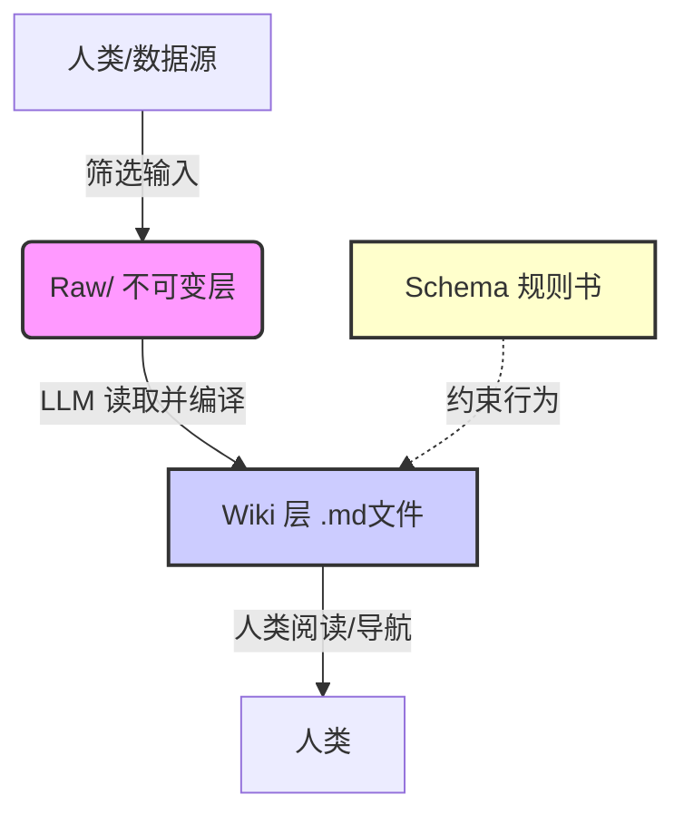
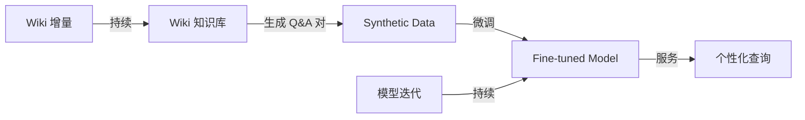

# LLM Wiki

## 从 RAG 到知识复利

Andrej Karpathy 的下一代知识管理范式

<div class="pt-12">
  <span @click="$slidev.nav.next" class="px-2 py-1 rounded cursor-pointer" hover="bg-white bg-opacity-10">
    开始探索 <carbon:arrow-right class="inline"/>
  </span>
</div>

---
layout: intro
---

# 谁是 Andrej Karpathy？

<span class="text-gray-400">AI 领域的先驱与布道者</span>

<div class="grid grid-cols-2 gap-4 mt-10">
<div>

- OpenAI 创始成员
- 特斯拉前 AI 总监 (Autopilot)
- 斯坦福 CS231n 讲师
- “软件 3.0” 概念的提出者

</div>
<div class="text-sm text-gray-400">
“他在 AI 社区拥有极高的声望，他的观点往往预示着下一代工具演进的方向。”
</div>
</div>

<div class="absolute bottom-10 left-0 right-0 text-center text-xs text-gray-500">
  Karpathy 最近提到：他消耗的 token 大部分已不在写代码，而在做知识管理。
</div>

---
layout: default
---

# 我们面临的问题

## 知识从未如此丰富，却又如此碎片化

<div class="grid grid-cols-2 gap-8 mt-8">
<div>

- **信息过载**：收藏夹里吃灰的文章越来越多。
- **缺乏积累**：每次处理新信息都像“从零开始”。
- **RAG 的局限**：传统的检索增强生成只是临时拼接，并非真正的理解。

</div>
<div class="border-l-2 border-orange-400 pl-4">
  <span class="text-orange-400 font-bold">💡 核心痛点</span>
  <p class="mt-2 text-gray-300 text-sm">
    我们拥有最好的“外脑”（LLM），却依然在用“纸笔”（传统笔记）的方式工作。
    知识与知识之间缺乏连接，无法产生 <span class="text-green-300">复利效应</span>。
  </p>
</div>
</div>

---
layout: default
---

# 现状：RAG 的“解释器模式”

## 每次查询都是重新发现

<div class="flex justify-center my-4">
  <div class="relative">
    <div class="border rounded-lg p-4 bg-gray-700">
      <div class="text-xs text-gray-400">查询: “总结五篇论文的核心冲突”</div>
      <div class="text-sm mt-2">➡️ 向量检索 Top-K 分块 ➡️ LLM 即时合成 ➡️ 输出答案</div>
    </div>
  </div>
</div>

| 特性 | 表现 |
| --- | --- |
| **行为模式** | **解释器 (Interpreter)**：边运行边解析，没有中间产物 |
| **每次成本** | 高（重复读取、切分、计算） |
| **知识沉淀** | ❌ 无。下次提问，流程重来 |
| **交叉引用** | ❌ 无法主动发现文档间的矛盾与关联 |

<div class="mt-4 text-center text-sm text-red-400">
  ⚠️ 就像每次计算 1+1 都要重新推导数学公理，极其低效。
</div>

---
layout: default
---

# 解决方案：LLM Wiki

## 引入“编译器模式”

<span class="text-2xl font-bold text-green-400">把原始语料编译成结构化的 Wiki</span>

<div class="mt-4 p-4 bg-gray-800 rounded-lg">
  <div class="font-mono text-sm">
  Raw Data (源文件) --<span class="text-yellow-400">(LLM 编译过程)</span>--> Structured Wiki (MD文件)
  </div>
  <div class="text-xs text-gray-400 mt-2">编译一次，永久运行；增量更新，累积知识。</div>
</div>

**类比解释：**
- **源代码**：你收集的 PDF、文章、网页。
- **编译器**：LLM Agent (Claude Code / GPT)。
- **可执行程序**：相互链接、带有摘要和索引的 Markdown Wiki。

---
layout: two-cols-header
---

# 核心隐喻：解释器 vs 编译器

## 这一类比贯穿了整个设计的灵魂

::left::

### 传统 RAG (解释器)
<div class="border rounded p-3 mt-2 bg-red-900/20 border-red-800">
- 运行时读取原始文件。
- 每次执行相同的解析逻辑。
- 没有状态，没有积累。
- <span class="text-red-300">慢且昂贵，无成长性。</span>
</div>

::right::

### LLM Wiki (编译器)
<div class="border rounded p-3 mt-2 bg-green-900/20 border-green-800">
- 预先编译成中间表示 (IR)。
- 执行时直接运行编译产物。
- 状态持续更新，知识复利。
- <span class="text-green-300">快且准确，越用越强。</span>
</div>

---
layout: default
---

# 架构纵览

## 三层的清晰解耦



---

# 第一层：Raw Sources

## 不可变的真理之源

- **内容**：论文 PDF、网页剪藏、代码片段、会议录音稿。
- **权限**：**只读**，AI 在此层没有任何写入权限。
- **作用**：
    - 事实的基准线 (Source of Truth)
    - 如果 Wiki 乱了，删了重建即可，Raw 永存
    - 防止 AI 幻觉污染源数据

<div class="bg-gray-800 p-2 rounded mt-4 font-mono text-xs">
  📁 raw/<br>
  ├── 📄 2024_attention_is_all_you_need.pdf<br>
  ├── 📄 karpathy_twitter_thread.txt<br>
  └── 🖼️ system_architecture_diagram.png
</div>

<div class="mt-4 p-2 bg-yellow-900/30 border-l-4 border-yellow-500 text-sm">
  ⚠️ 关键原则：Raw 文件夹是“只读”的。即使 AI 认为某段文字是“噪音”，也不能删除或修改。
</div>

---

# 第二层：The Wiki

## 由 LLM 维护的活文档

**目录结构示例：**
```bash
wiki/
├── index.md       # 总目录
├── log.md         # 操作日志（审计追踪）
├── entities/      # 人物/公司/组织
├── concepts/      # 核心概念与定义
├── summaries/     # 文档/论文摘要
├── comparisons/   # 对比分析
└── debates/       # 矛盾观点记录
```

---

# 关键特征：

- [Wiki 链接]：使用 [[Concept]] 语法建立互联
- Frontmatter：包含元数据（标签、创建时间、更新时间）
- 人类可读：纯 Markdown，可用 Obsidian 打开即 IDE
- Git 版本控制：每次变更都有记录

---

# 第三层：The Schema

## AI 的“员工手册”

<span class="text-lg">通常是一个 `CLAUDE.md` 或 `AGENTS.md` 文件。</span>

这是 Karpathy 强调的**关键配置文件**。它把通用大模型训练成纪律严明的 Wiki 管理员。

**Schema 必须包含：**

| 类别 | 内容 |
| --- | --- |
| **目录规范** | 实体放哪里？概念放哪里？命名规则是什么？ |
| **语法规则** | 必须使用双链、必须包含 YAML 头、禁止使用绝对路径 |
| **工作流** | 摄入新文章时的标准作业程序（SOP） |
| **质量红线** | 孤儿页面的处理方式、矛盾的标记语法 |
| **禁止项** | 严禁修改 `raw/`、严禁删除无警告 |

<div class="mt-4 text-xs text-gray-400">
  说白了：你把 Schema 写好了，就等于给 AI 发了一本《员工手册》，它就知道该怎么干活了。
</div>

---

# Schema 示例

## 一个完整的 CLAUDE.md 模板

```markdown
# LLM Wiki Schema v1.0

## 目录结构
- raw/          # 只读，禁止写入
- wiki/
  ├── index.md      # 全局导航
  ├── log.md        # 操作日志
  ├── entities/     # 人物/组织 (命名: firstName_lastName.md)
  ├── concepts/     # 概念 (命名: kebab-case.md)
  ├── summaries/    # 摘要 (命名: source_short_name.md)
  └── comparisons/  # 对比分析

## 语法规则
1. 每个页面必须有 YAML frontmatter:
   ---
   title: 标题
   created: YYYY-MM-DD
   updated: YYYY-MM-DD
   tags: [tag1, tag2]
   ---
2. 必须使用 [[PageName]] 格式的双链
3. 禁止使用绝对路径

## 摄入工作流
1. 读取 raw/ 中的新文件
2. 提取核心观点、实体、概念
3. 对每个实体: 创建或更新 wiki/entities/ 下的页面
4. 对每个概念: 创建或更新 wiki/concepts/ 下的页面
5. 创建摘要页面 wiki/summaries/
6. 更新 wiki/index.md 和 wiki/log.md

## 矛盾处理
- 不要删除或覆盖现有结论
- 使用 ⚠️ **Contradiction** 标记新观点
- 格式: > ⚠️ Contradiction: [新观点] (来源: [source])

---

# 核心操作

- Ingest
- Query
- Lint

---

---
layout: default
---

# 对比：LLM Wiki vs. 传统 RAG

| 维度 | 传统 RAG（解释器） | LLM Wiki（编译器） |
| --- | --- | --- |
| **核心资产** | 向量数据库 + 原始文本切片 | **结构化的 Markdown 文件** |
| **查询机制** | 语义相似度搜索 | **索引导航 + 深度阅读** |
| **知识积累** | ❌ 无状态，每次查询独立 | ✅ **有状态，持续演进** |
| **可解释性** | 黑盒检索，难以审计 | ✅ **人类可读的中间件** |
| **规模成本** | 随查询次数线性增长 | **编译一次性成本高，查询极低** |
| **幻觉风险** | 较高（依赖即时上下文） | **较低（基于编译产物）** |
| **维护者** | 开发者（构建 Pipeline） | **AI Agent（持续整理）+ 人类策展** |
| **离线可用** | 依赖向量库 | ✅ **纯文本，任何编辑器可读** |
| **更新机制** | 重新索引或增量更新 | **增量编译，只改受影响的页面** |
| **跨文档推理** | 依赖上下文窗口大小 | **通过双链任意跳转，无窗口限制** |
| **人类参与** | 仅查询阶段 | **贯穿全流程（策展 + 查询 + 决策）** |
| **工具依赖** | 需要向量数据库 + Embedding 模型 | **仅需文件系统 + Obsidian（可选）** |
| **版本控制** | 难以追踪知识变化 | ✅ **Git 原生支持，完整审计** |
| **知识冲突处理** | 无法处理，后进覆盖先进 | **标记 ⚠️ Contradiction，保留双方观点** |

---

# 未来演进趋势



| 阶段 | 产物 | 价值 |
| --- | --- | --- |
| 1. 编译 | Wiki（Markdown） | 人类可读、RAG 可用 |
| 2. 合成 | Q&A Pairs | 训练数据 |
| 3. 微调 | 私人 LoRA | 知识内化到权重 |
| 4. 推理 | 个性化模型 | 低延迟、私有 |

---

# 实操

现场演示


- LLM Wiki 不是一个具体的产品，它是一种 **元框架（Meta-framework）**。

## 它重新定义了

| 角色 | 传统职责 | LLM Wiki 职责 |
| --- | --- | --- |
| **人** | 整理、归类、写笔记 | **策展、提问、决策** |
| **机器** | 被动检索 | **阅读、整理、写入、维护** |