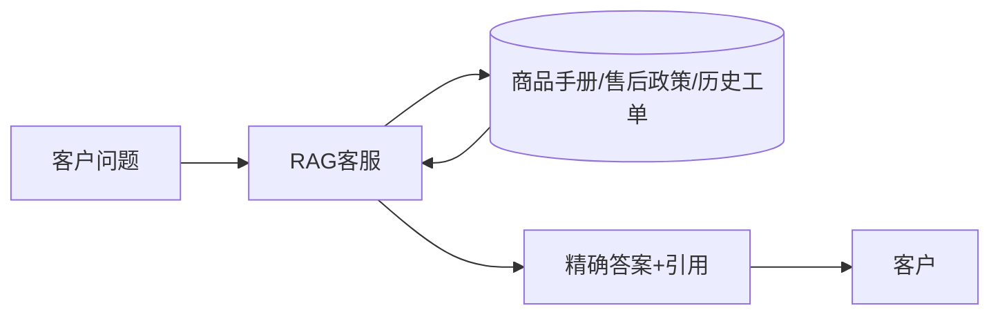
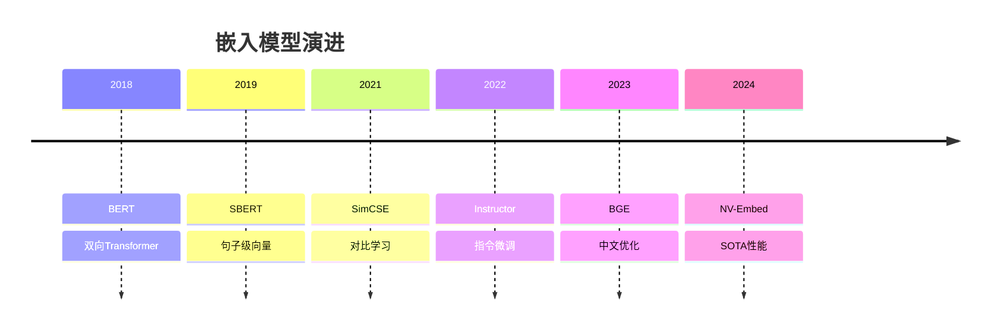
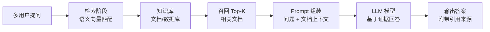

# RAG技术解析

## RAG = Retrieval-Augmented Generation，检索增强生成

---
layout: two-cols-header
---

# 目录 CONTENTS

::left::

## 01. RAG技术深度解析
- 大模型的困境与RAG的诞生
- RAG核心定义与工作原理
- RAG vs. 微调：如何选择？
- RAG技术发展历程与分类

## 02. RAG技术全链路详解
- 阶段一：知识库构建 (Indexing)
- 阶段二：检索与生成 (Inference)
- RAG进阶优化与评估

::right::

## 03. 实践篇：lightRAG框架详解
- lightRAG简介与核心特点
- 核心架构解析：图索引与双层检索
- 与传统RAG的对比优势
- 部署与实践流程

## 04. 实践篇：使用cherry studio构建知识库
- cherry studio简介与核心功能
- 操作指南：从零搭建私域问答助手
- 高级技巧

---

# PART 01 - RAG技术解析

---
layout: two-cols-header
---

# 大模型的困境：企业级应用的瓶颈

::left::

## 01. 知识滞后 (Knowledge Cutoff)
模型知识冻结在训练数据的截止日期前，无法获取最新信息。例如，无法回答关于2025年后发布的新产品或发生的热点事件。

## 02. 模型幻觉 (Hallucination)
模型倾向于生成看似合理但与事实不符的内容。在法律、医疗、金融等强事实性领域，这是不可接受的隐患。

::right::

## 03. 私有知识壁垒
通用模型无法直接访问企业内部的私有数据库、未公开的技术文档和积累的行业Know-how，难以成为真正懂业务的“企业级专家”。

## 04. 上下文窗口限制
处理超长文档（如数百页的财务报表、复杂的法律合同）时，信息理解能力受限且调用成本高昂，难以支撑大规模的企业级长文本处理需求。

---

# 困境一：知识滞后 (Knowledge Cutoff)

模型的知识库存存在明显的“截止日期”，无法获取训练数据截止后的任何信息。这导致其无法回答超出其“知识保质期”的问题，如同只读了过去书籍的“学者”。

**用户提问：** “2026年最新发布的AI芯片有哪些型号？性能如何？”
**模型回答：** “很抱歉，我的知识截止到2024年，无法提供2026年发布的AI芯片相关信息。”

### 实时性应用受限
无法有效支持依赖最新资讯的高频场景，例如即时新闻摘要、动态金融市场分析、最新消费电子产品咨询等，应用范围受限于时效性低的领域。

### 知识更新成本高昂
现有架构下，模型知识的迭代严重依赖于昂贵且耗时的“全量重新训练”，无法实现低成本、快速的知识增量更新，难以跟上现实世界的信息变化速度。

---

# 困境二：模型幻觉 (Hallucination)

模型倾向于“一本正经地胡说八道”，在生成内容时可能会编造看似合乎逻辑、但实际上与现实事实完全不符的信息。

**场景举例：**
- **用户提问：** “我们公司的XX产品有哪些功能？”
- **模型回答：** “XX产品拥有A、B、C三项核心功能，其中C功能是行业首创...”（实际上产品并没有C功能）

### 核心痛点：
- **严重后果：** 在法律、医疗、金融等强事实性领域，错误信息可能导致严重后果。
- **答案不可控：** 无法保证事实一致性，阻碍建立用户信任。

---
layout: two-cols-header
---

# RAG的诞生：为大模型开启“开卷考试”

::left::

**核心思想：大模型的“开卷考试”**

在回答客户问题前，先从一个可随时更新的外部知识库中检索最相关的信息片段，将其作为上下文(Context)提供给大模型，引导它基于这些“参考资料”生成答案。

**RAG的价值：**
- **知识实时更新**
- **消除模型幻觉**
- **访问私有知识**
- **处理超长文档**

::right::


---

# RAG应用案例



---

# RAG核心定义与工作原理

**什么是检索增强生成(RAG)?**
一种将信息检索技术与大语言模型(LLM)深度融合的AI架构。通过在生成答案前动态引入外部知识库，为LLM注入新鲜、精准的事实信息，有效打破了传统大模型依赖静态预训练知识导致的“知识截止”与“幻觉”局限。

### 01/离线索引 (Indexing)
**核心目标：** 构建可检索的知识库
在用户提问前，对网页、文档等外部知识源进行清洗、切分、向量化，并存储到向量数据库中，建立索引。这是RAG的“准备阶段”。

### 02/在线推理 (Inference)
**核心目标：** 回答用户问题
接收用户查询并检索出相关的知识片段，将这些片段与原始问题拼接，作为Prompt输入给LLM生成答案。这是RAG的“服务阶段”。

---

# 阶段一：离线索引 (Indexing) - 构建知识库

### 01 LOAD - 文档加载
收集所有分散的原始知识，包括PDF、Word、TXT等文档格式，以及公开网页、企业内部知识库等多种来源。

### 02 CHUNKING - 文本分块
将长文档切割成更小、语义完整的文本块(Chunks)，确保每一块都包含独立且有意义的信息，这是影响检索增强生成(RAG)效果的关键步骤。

### 03 EMBEDDING - 向量化
利用深度学习嵌入模型(Embedding Model)将非结构化的文本转化为计算机可理解的高维向量，保留文本的语义信息，便于后续计算相似度。

### 04 STORE - 存储入库
将转换后的向量数据及其对应的原始文本一起持久化存储到高性能向量数据库(Vector Database)中，构建成可快速检索、实时响应的企业级知识库。

---


# 阶段二：在线推理 (Inference) - 回答用户问题

### 01. 查询向量化 (Query Embedding)
将用户的自然语言问题(Query)转换为高维向量，使其格式与知识库中的向量保持一致，为后续的检索计算奠定基础。

### 02. 检索 (Retrieve)
基于向量相似度算法，在向量数据库中进行快速检索，找出与用户问题语义最匹配的Top-K个相关文本块，作为回答的支撑材料。

### 03. Prompt构建 (Prompt Augmentation)
将检索出的相关文本块作为“上下文知识”，与原始用户问题有机结合，构建一个信息更丰富、指向性更明确的增强Prompt。

### 04. 生成 (Generate)
将增强后的Prompt输入给大语言模型(LLM)，模型在限定的上下文知识范围内进行推理和总结，生成既准确又自然的最终回答。

---

# RAG关键模块 - Embedding

- **Embedding** 是 RAG 的关键组件  
- 将文本映射到向量空间，便于相似度计算  
- 支持高效检索（如向量数据库）  
- 生成阶段依赖 Embedding 信息进行上下文建模  




---

# 文本向量化原理

- **词嵌入（Word Embedding）**  
  - Word2Vec / GloVe  
- **句子嵌入（Sentence Embedding）**  
  - 汇总词向量或使用模型直接生成  
- **段落/文档嵌入**  
  - 长文本的向量表示方法  
- **相似度计算基础**  
  - 余弦相似度、欧氏距离等  

---

# 传统 Embedding 方法

- **Word2Vec**  
  - CBOW 和 Skip-gram 模型  
  - 依赖预训练词表，无法捕捉上下文  
- **GloVe**  
  - 基于全局统计的词向量  
  - 适用于静态词表  
- **FastText**  
  - 支持子词信息，处理未登录词更优  


## BERT 系列模型
- **BERT 的结构**  
  - Transformer 编码器架构  
  - 预训练任务：Masked LM + Next Sentence Prediction  
- **BERT 生成 Embedding**  
  - [CLS] token 的全局表示  
  - 句子嵌入：CLS 向量或平均池化  
- **BERT 在 RAG 中的应用**  
  - 作为生成模型的上下文编码器  
  - 作为检索的语义向量计算工具  

---

# Sentence-BERT 模型

- **Sentence-BERT** 的特点  
  - 针对句子级别的嵌入优化  
  - 支持孪生网络（Siamese Network）训练  
- **模型结构**  
  - BERT 的修改版：使用 [CLS] token 或均值池化  
  - 相似度计算：通过余弦相似度  
- **Sentence-BERT 优势**  
  - 更高效的句子级向量生成  
  - 支持多语言版本（如 SBERT、Multi-Task BERT）  

---

# DPR（Document-Preserving Retrieval）

- **DPR 的核心思想**  
  - 将文档嵌入为向量，便于检索  
  - 使用 Transformer 编码器生成文档嵌入  
- **模型架构**  
  - Query Encoder 和 Document Encoder 分离  
  - 每个组件独立训练  
- **DPR 在 RAG 中的作用**  
  - 提供高质量的文档检索能力  
  - 支持大规模文档库的高效搜索  

---

# 与检索系统的结合

- **Embedding 在检索中的角色**  
  - 将文本转换为向量，支持向量相似度检索  
  - 常用场景：语义搜索、文档匹配  
- **典型检索系统**  
  - FAISS（Facebook AI Similarity Search）  
  - Whoosh / Elasticsearch（支持向量扩展）  
  - Milvus / Qdrant（向量数据库）  

---

# 生成阶段与 Embedding 的关系

- **生成模型的输入**  
  - 用户查询 + 检索的上下文  
- **Embedding 在生成中的作用**  
  - 提供上下文语义信息  
  - 引导生成更准确的回答  
- **生成模型类型**  
  - 基于 Transformer 的解码器（如 GPT、T5）  

---

#
# 嵌入模型对比分析


| 模型          | 特点                         | 适用场景               | 优缺点                   |
|---------------|------------------------------|------------------------|--------------------------|
| BERT          | 上下文感知，双向Transformer    | 精确语义匹配           | 计算开销大               |
| Sentence-BERT | 句子级优化，支持相似度计算     | 语义检索、句子匹配     | 更高效，但需预训练       |
| DPR           | 分离查询与文档编码器           | 文档检索               | 检索准确率高，但需微调   |

---

# 模型优化方向

- **轻量化嵌入模型**  
  - DistilBERT、ALBERT  
- **高效训练方法**  
  - 使用负采样、负例生成  
- **多模态嵌入**  
  - 将文本、图像、音频等信息融合  

## 与传统模型的区别
- **传统模型（如 TF-IDF）**  
  - 依赖关键词统计  
  - 无法捕获语义信息  
- **Embedding 模型**  
  - 语义级表示  
  - 支持复杂语义匹配  
- **RAG 的独特优势**  
  - 动态结合外部知识库  
  - 避免模型幻觉（Model Hallucination）  

---
layout: two-cols
---

## Embedding的挑战与局限性

- **计算资源需求高**  
  - 嵌入生成和相似度计算需高性能硬件  
- **数据偏差问题**  
  - 嵌入质量依赖训练数据  
- **模型泛化能力限制**  
  - 检索与生成的协同优化仍需改进  

::right::

## 未来发展方向
- **更高效的嵌入模型**  
  - 区域性嵌入（Regional Embedding）  
- **端到端优化**  
  - 检索与生成共同训练  
- **轻量化部署**  
  - 模型压缩、量化、蒸馏技术  

---

# RAG关键模块 - Rerank模型


**Rerank**（重排序）是一种**两阶段检索**中的第二阶段

- 第一阶段：使用高效（但低精度）的检索器（如 BM25、Embedding 检索）召回 top-K 候选文档
- 第二阶段：使用更精确（通常更慢）的模型对候选文档**重新打分排序**
- 目的：在保持高召回的同时，大幅提升排序的**精度**和**相关性**
- 早期方法：基于特征的手动排序（如 TF-IDF、BM25）
- 现代方法：基于深度学习的交叉编码器（Cross-Encoder）或交互式模型


## Rerank 在 RAG 中的作用

用户查询 ──→ 检索器 ──→ Top-K 文档 ──→ Reranker ──→ 精排文档 ──→ 生成器

- **提升生成质量**：减少幻觉、提高上下文相关性
- **降低噪音**：过滤掉不相关或低质文档
- **支持更多候选**：检索器可以取较大的 K（如 100），再由 Rerank 精排取 top-3 用于生成
- **可控性**：可针对业务场景微调 Rerank 模型

---

# 两阶段检索 vs 单阶段检索

| 维度 | 单阶段 | 两阶段（Retrieval + Rerank） |
| --- | --- | --- |
| 精度 | 较低 | 高（尤其当 K 较大时） |
| 速度 | 快 | 第一阶段快，第二阶段慢（但候选少） |
| 模型复杂度 | 简单（如双编码器） | 复杂（交叉编码器） |
| 可扩展性 | 适合亿级 | 适合千万级（受限于第二阶段成本） |
| 典型场景 | 快速搜索 | 高精度问答、对话系统 |

- 现代 RAG 系统**普遍采用两阶段架构**

---

# Rerank 的核心原理

- **输入**：query + 候选文档 pair
- **核心思想**：让 query 和文档进行**深度交互**，计算相关性分数
- 与双编码器（Dense Retrieval）不同，不单独编码 query 和文档，而是将两者拼接 / 组合后输入模型
- 输出：相关性得分（通常为 0~1 或 logits）


---

# Rerank 模型类型

| 类型 | 代表模型 | 特点 |
| --- | --- | --- |
| Cross-Encoder | BERT, RoBERTa | 直接计算 query-doc 交互，精度最高，但无法预计算 doc 向量 |
| Late Interaction | ColBERT | 保留 token 级别向量，后期做 MaxSim，速度/精度折中 |
| 基于 LLM | MonoT5, RankLLaMA | 使用生成式模型输出相关性标记（true/false），适合小样本 |
| 专用 Rerank | Cohere Rerank, BGE-Rerank | 经检索微调，开箱即用 |

- 选择依据：精度需求、延迟预算、硬件资源

---

# 经典模型：Cross-Encoder

- **结构**：BERT / RoBERTa + 分类头
- **输入**：`[CLS] query [SEP] doc [SEP]`
- **输出**：相关性 logits
- **优点**：最高精度，query 和 doc 完全交互
- **缺点**：推理时每个 query-doc pair 都要独立前向，无法缓存 doc 表示，耗时 O(k)
- **使用方式**：对检索到的 k 个文档逐一打分，取 top-n
- **代表模型**：
  - `cross-encoder/ms-marco-MiniLM-L-6-v2`
  - `BAAI/bge-reranker-v2-m3`

---

# 经典模型：ColBERT

- **论文**：ColBERT: Efficient and Effective Passage Search via Contextualized Late Interaction over BERT (2020)
- **核心思想**：Late Interaction
  - 分别编码 query 和 doc 为 token 级别向量
  - 计算 query token 与 doc token 之间的**最大相似度**（MaxSim）
  - 聚合得到最终分数
- **优点**：
  - 支持预计算 doc 向量并存储（类似双编码器）
  - 推理速度远快于 Cross-Encoder，但精度接近
- **代表实现**：`ColBERTv2`, `ColBERT-PRF`

---

# 经典模型：Cohere Rerank

- **产品**：Cohere 提供的 Rerank API（`rerank-english-v3.0` 等）
- **特点**：
  - 支持多种语言（英文、多语言）
  - 可直接返回排序后的结果
  - 可设定 `top_n` 和 `max_chunks_per_doc`
- **使用方式**：API 调用，无需自己训练
- **优点**：开箱即用、精度高、稳定
- **缺点**：依赖网络、有成本、隐私问题（需传文档）
- **适用**：中小规模、快速原型

---

# 经典模型：BGE-Rerank

- **来自**：北京智源研究院（BAAI）
- **模型**：`BAAI/bge-reranker-v2-m3`（多语言、30 亿参数）
- **特点**：
  - 基于 XLM-RoBERTa 或 mBERT，支持中英文
  - 在 MS MARCO 和多个数据集上微调
  - 开源、可私有化部署
- **精度**：在 BEIR 等 benchmark 上接近 SOTA
- **使用方式**：
  ```python
  from transformers import AutoModelForSequenceClassification
  model = AutoModelForSequenceClassification.from_pretrained("BAAI/bge-reranker-v2-m3")

---

# 经典模型：MonoT5

- **论文**：Document Ranking with a Pretrained Sequence-to-Sequence Model (2020)
- **核心**：使用 T5 模型，将排序任务转化为**文本生成**任务
- **输入**：`Query: q Document: d Relevant:`
- **输出**：生成 `true` 或 `false`（或 `1`、`0`）的概率
- **优点**：
  - 利用 T5 的生成能力，零样本泛化好
  - 可同时输出置信度
- **缺点**：推理速度较慢（自回归生成）
- **代表模型**：`castorini/monot5-base-msmarco`

---

# 经典模型：RankLLaMA / RankZephyr

- **背景**：基于 LLaMA / Zephyr 等大型语言模型微调的 Rerank 模型
- **代表**：
  - `castorini/rankllama-v1-7b-lora-passage`
  - `castorini/rankzephyr-7b-v1`
- **方法**：
  - 使用 prompt 模板（如 `Passage: ... Query: ... Does the passage answer the query?`）
  - 输出 Yes/No 的概率作为分数
- **特点**：
  - 强大的语义理解能力，尤其适合复杂查询
  - 参数量大，推理成本高
  - 可通过 LoRA 等方式微调

---

# 模型对比与选型

| 模型 | 精度 | 速度 | 部署难度 | 典型场景 |
| --- | --- | --- | --- | --- |
| Cross-Encoder (MiniLM) | 高 | 中 | 低 | 通用 RAG |
| ColBERT | 较高 | 快（可预计算） | 中 | 大规模检索增强 |
| Cohere Rerank API | 很高 | 快（API） | 低（需网络） | 快速集成 |
| BGE-Rerank | 高 | 中 | 低 | 中文/多语言 |
| MonoT5 | 高 | 慢 | 中 | 学术/高精度 |
| RankLLaMA | 最高 | 很慢 | 高 | 复杂推理 |

- **推荐组合**：
  - 生产：BGE-Rerank 或 Cohere Rerank
  - 研究：MonT5 或 RankLLaMA
  - 效率优先：ColBERT

---

# Rerank 训练数据构造

- **常见数据格式**：`(query, positive_doc, negative_doc)`
- **负样本来源**：
  - 检索返回的非相关文档（hard negative）
  - 随机采样（easy negative）
  - 使用 BM25 或其他检索器生成难负例
- **损失函数**：
  - 交叉熵损失（二分类）
  - 排序损失（RankNet、LambdaRank）
  - 对比损失（infoNCE）
- **数据规模**：通常需要数千至数万对
- **微调策略**：
  - 全参微调（适合 110M ~ 330M 参数）
  - LoRA / Adapter（适合 7B+ 参数）

---

# Rerank 的部署与效率

- **延迟**：Cross-Encoder 对每个候选 doc 都要推断，总延迟 = k × 单次推断时间
  - 优化：使用小模型（如 MiniLM）、量化（ONNX、TensorRT）
  - 批处理：将 k 个 pair 合并为 batch 推理
- **内存**：单模型通常几百 MB ~ 几 GB
- **大规模候选**：
  - 第一阶段检索 K=100，rerank 取 top-3
  - 对延时敏感的场景可采用 ColBERT 或稀疏交互模型
- **GPU 加速**：推荐使用 A10 / V100 及以上
- **无服务器部署**：AWS SageMaker、Modal、BentoML

---

# Rerank 实践技巧与注意事项

1. **候选数量 K** 的选择：建议 20~100，过大增加延迟且收益递减
2. **文档分块**：长文档先切分成 chunk，rerank 后合并 chunk 分数
3. **多阶段 rerank**：可先用轻量模型（如 MiniLM）粗排，再用大模型精排
4. **分数归一化**：不同模型分数范围不同，可 softmax 或 min-max 归一化后用于生成器
5. **避免偏见**：Rerank 模型可能放大检索阶段的排序偏差，需定期评估
6. **数据新鲜度**：定期用新数据微调，防止知识过期
7. **A/B 测试**：上线前与仅检索阶段对比 end-to-end 指标

---

# rerank 未来趋势

- **端到端模型**：检索、rerank、生成三合一（如 RAG 微调整个流程）
- **高效交互**：ColBERT 系列的持续改进（如 PLAID）
- **LLM 作为 Reranker**：利用 GPT-4 / Claude 等闭源模型进行排序（零样本）
- **多模态 Rerank**：对图像、视频片段等进行相关性排序
- **推理加速**：KV-cache 复用、稀疏注意力
- **领域适应**：垂直领域（医疗、法律、金融）专用 Rerank 模型

## 总结

- **Rerank 是 RAG 系统中提升精度的关键组件**
- **核心原理**：让 query 和候选文档进行深度交互打分
- **主流模型**：Cross-Encoder（高精度）、ColBERT（高效率）、MonoT5 / RankLLaMA（强理解）
- **选型依据**：精度、延迟、成本、数据隐私
- **实践要点**：候选数量、分块策略、多阶段排序、持续评估
- 推荐组合：Embedding 检索 + BGE-Rerank / Cohere Rerank + 生成 LLM

---

# RAG完整工作流程图



---

# 示例：RAG in Dify

## Install Dify via Docker

Docker Setting > Docker Engine

```
{
  "builder": {
    "gc": {
      "defaultKeepStorage": "20GB",
      "enabled": true
    }
  },
  "experimental": false,
  "max-concurrent-downloads": 1,
  "registry-mirrors": [
    "https://docker.1ms.run",
    "https://docker.xuanyuan.me",
    "https://dockerpull.com",
    "https://docker.anyhub.us.kg",
    "https://dockerhub.jobcher.com",
    "https://dockerhub.icu",
    "https://docker.awsl9527.cn"
  ]
}
```
---

# Revise .env

Change `EXPOSE_NGINX_PORT` and `EXPOSE_NGINX_SSL_PORT` if needed

```
# Nginx and Docker Compose
NGINX_SERVER_NAME=_
NGINX_HTTPS_ENABLED=false
NGINX_PORT=80
NGINX_SSL_PORT=443
NGINX_SSL_CERT_FILENAME=dify.crt
NGINX_SSL_CERT_KEY_FILENAME=dify.key
NGINX_SSL_PROTOCOLS=TLSv1.2 TLSv1.3
NGINX_WORKER_PROCESSES=auto
NGINX_CLIENT_MAX_BODY_SIZE=100M
NGINX_KEEPALIVE_TIMEOUT=65
NGINX_PROXY_READ_TIMEOUT=3600s
NGINX_PROXY_SEND_TIMEOUT=3600s
NGINX_ENABLE_CERTBOT_CHALLENGE=false
NGINX_SOCKET_IO_UPSTREAM=api_websocket:5001
EXPOSE_NGINX_PORT=8080 # avoid conflict with svn server
EXPOSE_NGINX_SSL_PORT=8443
COMPOSE_PROFILES=${VECTOR_STORE:-weaviate},${DB_TYPE:-postgresql},collaboration
```

---

```
dify\docker>docker compose up –d
```

Then go to http://localhost:8080 (the port set in .env)


---

Fee: < 2 RMB for 20 pdf papers


---


---
layout: two-cols-header
---

# RAG vs. 微调 (Fine-tuning)：如何选择？

::left::

## RAG · 检索增强生成
- **核心目标：** 注入外部事实知识，约束生成内容，确保回答基于特定文档。
- **数据门槛：** 无需人工标注，直接使用原始文档（如PDF、知识库）即可。
- **知识迭代：** 增量更新成本极低，新信息上线后分钟级生效，灵活敏捷。
- **风险与成本：** 事实一致性强，可溯源，从根源降低幻觉；主要产生推理侧算力成本。

::right::

## Fine-tuning · 模型微调
- **核心目标：** 让模型学习特定领域的表达风格、格式规范，或将特定任务的解决范式。
- **数据门槛：** 需要大量高质量、结构工整的“问题-答案”标注数据，数据清洗成本高。
- **知识迭代：** 需全量数据重新训练，更新周期长，难以快速响应新知识。
- **风险与成本：** 事实性弱可控，错误知识可能被“固化”；训练侧算力成本极高。

---

# RAG vs. 微调：选型建议


---

## 选择 RAG，如果你的需求是：
- 回答关于特定、动态文档的事实性问题
- 知识需要高频次更新
- 对答案的事实一致性与可溯源性要求高
- 预算有限，希望低成本实现

## 选择 微调，如果你的需求是：
- 让模型模仿特定的风格（如法律文书、莎士比亚体）
- 学习特定任务的格式或范式（如代码生成、写诗）
- 知识更新频率低，且有高质量的标注数据

## 两者结合：复杂场景的最优解
- 先用微调让模型学会“如何回答”（如特定输出格式/逻辑）
- 再用RAG提供“回答所需的事实”，兼顾准确性与可控性。

---

# RAG技术发展历程与分类

### Naive RAG (基础版)
- **核心特点：** 遵循标准的“检索-生成”两阶段流程，不引入额外的优化策略，逻辑简单直接。
- **应用定位：** RAG技术的入门教学范本，也是进行功能原型验证和POC测试的首选方案。

### Advanced RAG (进阶版)
- **核心特点：** 对“检索-生成”全链路进行系统性优化，如混合检索、Cohere Reranker重排序、查询改写等多步推理等。
- **应用定位：** 当前大模型应用落地中最主流的架构方案，能有效解决实际问题并提升回答准确性。

### Modular RAG (模块化)
- **核心特点：** 将RAG系统彻底解耦为独立、可插拔的功能模块，支持与图神经网络(Graph RAG)、智能体(Agent)深度融合。
- **应用定位：** 兼顾灵活性与扩展性，代表了未来企业级、复杂知识场景的主要发展方向。

---

# PART 02
## RAG技术全链路详解

---

# 阶段一：知识库构建 (Indexing) - 文档加载与预处理

### 核心目标
将PDF、Word、HTML、扫描件等异构文档转化为干净、规范、结构化的纯文本数据，消除格式壁垒。

### 多格式解析
利用PyMuPDF, python-docx, BeautifulSoup等专用库，或直接使用LangChain/LlamaIndex的Loader组件，统一读取不同来源的文件。

### 非结构化内容处理
针对扫描件应用高精度OCR技术还原文本；对表格数据进行智能解析并统一转化为Markdown格式，便于后续检索。

### 数据清洗与降噪
自动化去除无关的页眉页脚、水印、重复空行和乱码，确保输入模型的文本“信噪比”处于高水平。

### 文档结构保留
在处理过程中，最大程度保留文档的标题层级、章节段落等逻辑结构，为后续的分块(Chunking)提供语义边界参考。

---

# 阶段一：文本分块 (Chunking) - RAG的核心瓶颈

**目标：平衡检索的精准度和生成的上下文完整性**
块太小容易丢失上下文，导致生成信息不完整；块太大则会引入噪声，降低检索的准确性。

### 固定长度分块 (Fixed-size)
- **做法：** 按固定Token数（如512）切分，通常会设置一定的重叠率以减少信息丢失。
- **优点：** 实现简单，计算效率高，处理速度快。
- **缺点：** 无法理解语义，可能切断完整的语义逻辑单元。

### 语义感知分块 (Semantic)
- **做法：** 利用大模型或Embedding计算句子间的语义相似度，在语义发生显著变化的边界进行切分。
- **优点：** 最大程度保留语义完整性，减少信息割裂。
- **缺点：** 需要调用模型，计算成本较高，处理耗时。

### 结构感知分块 (Structural)
- **做法：** 根据文档的固有结构（如Markdown标题层级、段落、章节）进行切分。
- **优点：** 保留了文档的原始逻辑结构，检索需要符合阅读习惯。
- **缺点：** 严重依赖高质量的文档解析器，对非结构化文档支持较差。

---

# 文本分块方法对比


### 固定长度分块
机械地按字符数切割，容易切断句子和段落，破坏语义完整性，仅适合对连贯性要求不高的场景。

### 语义感知分块
能够识别自然语言的语义边界，在段落结束或话题转换处切割，能较好地保持内容的上下文连贯性。

### 结构感知分块 (推荐首选)
严格按照文档的标题层级(H1/H2/H3)切割，完美保留文档逻辑结构。若文档结构清晰，此方法效果最佳。

---

# 阶段一：文本向量化 (Embedding)

### 01/核心目标
#### 语义空间映射
将非结构化的自然语言文本，转化为计算机可理解的高维实数向量。在这个高维的“语义空间”中，含义越相似的文本，它们对应的向量在空间中的距离就越近，反之则越远。

### 02/模型选型
#### 闭源模型 (SaaS)
- OpenAI `text-embedding-3`系列、Google `Gemini Embedding`、以及智谱、通义、文心等国内大模型厂商的Embedding API。特点是开箱即用，性能优异。

#### 开源模型 (私有化)
- BGE系列 (如 `bge-large-zh`)、M3E、gte等。适合对数据隐私有严格要求，需要本地部署的企业级场景。

### 03/关键原则
#### 严禁“模型混用”
在同一个检索问答系统中，用于处理知识文档和用于处理用户查询(Query)的嵌入模型，必须是完全相同的一个模型。不同模型的向量化规则不同，生成的向量无法在同一个空间中比较，强行计算相似度没有任何意义。

---

# 阶段一：向量存储 (Vector Storage)

**核心目标：** 构建高可用、可扩展的存储架构，实现海量非结构化数据向量的持久化存储，并支持毫秒级、高准确率的相似度检索。

### 主流解决方案选型
- **专用向量数据库 (生产环境首选)**
  代表: Milvus, Zilliz Cloud, Pinecone | 支持大规模集群扩展与高可用架构。
- **传统数据库扩展 (生态复用)**
  代表: PostgreSQL + pgvector | 适合已有PG生态，需平衡结构化与向量数据的场景。
- **本地轻量级库 (原型验证/小规模)**
  代表: FAISS, Chroma | 部署简单，适合算法原型验证或小体量应用。


### 核心提速技术：向量索引
- **Flat (暴力搜索) - 基准标杆**
  遍历全库对比，精度100%，但在百万级以上数据中速度极慢。
- **IVF_FLAT (倒排索引) - 平衡之选**
  基于K-means的向量聚类，先缩小检索范围，在保证较高召回率的同时大幅提升速度。
- **HNSW (图索引) - 工业界最主流**
  构建多层候选节点图结构，兼顾极高的检索速度与召回率，适用于亿级海量数据场景。

---

# 阶段二：检索策略 (Retrieval)

**核心目标：** 从海量的知识库中，通过算法模型精准、高效地召回与用户提问最相关的文本块，为后续回答提供坚实基础。

### 稠密检索 (Dense)
- **原理：** 基于向量相似度，擅长捕捉深层语义。
- **示例：** 用户问“如何提升工作效率”，能匹配到“怎样让日常任务处理得更快”，解决了同义词无法匹配的问题。

### 稀疏检索 (Sparse)
- **原理：** 基于TF-IDF或BM25算法，擅长精准匹配。
- **示例：** 检索“Milvus”，只会匹配到文档中明确包含“Milvus”的内容。对专业术语和特定名词的查找非常精准。

### 混合检索 (Hybrid)
- **地位：** 工业界标配方案。
- **优势：** 结合稠密与稀疏检索的优势，既保留了对专业名词的精确匹配能力，又拥有了理解自然语言的泛化能力，是平衡召回率和准确率的最佳实践。

---

# 阶段二：重排序 (Re-ranking) - 必加优化

### 核心目标
对初轮检索出的Top-K（如Top-50）候选块进行二次打分与精排，精准筛选出最相关的Top-N（如Top-5）个文档块，为回答生成提供最高价值上下文。

### 关键技术
引入专门的重排序模型（如bge-reranker），深入理解用户查询与文档块之间复杂的语义交互关系，解决传统检索“字面匹配”的局限性。

### 显著效果
在大多数场景下，能将检索的最终精准率提升**30%以上**，显著改善回答质量。

### 推荐模型：BGE Reranker
基于Transformer架构的轻量级高性能模型，在中英文混合检索场景下表现优异，具有极强的泛化能力，是目前RAG架构中重排序步骤的主流选择之一。

### 流程
1. **初筛召回：** 通过混合检索从海量数据中召回Top-K个候选块。
2. **精排打分：** 对候选块进行相关性打分并排序，精准筛选出Top-N个块。
3. **生成回答：** 将筛选出的Top-N个块作为上下文，输入给LLM生成最终答案。

---

# 阶段二：Prompt工程与优化

**目标：** 构建清晰的指令，引导模型仅基于上下文生成答案，杜绝“幻觉”并确保信息的准确性与可溯源性。

### 强约束原则
明确指令边界：“仅使用提供的上下文回答，禁止编造”。若信息缺失，需直接反馈“未找到相关信息”。

### 结构化原则
为每个上下文分块分配唯一编号，并清晰标注信息来源，便于模型精准引用和用户追溯依据。

**示例 Prompt 模板**
你是一个严谨的问答助手，请遵循以下准则：
答案必须完全来自参考上下文；
无相关信息回答 “未找到相关信息”；
回答后必须标注引用来源编号。
【参考上下文】
[n1] [文本内容 1] - 来源：《产品手册》
[n2] [文本内容 2] - 来源：《年度分析报告》
【用户问题】
{user_query}
plaintext

---

# 阶段二：大模型生成与参数调优

**模型选型：** 根据业务需求灵活选择闭源模型（如GPT-4o, Claude 3）或开源模型（如Llama 3, Qwen），平衡成本与性能要求。

### Temperature (温度)
- **核心作用：** 控制回答的随机与创造性程度。
- **RAG推荐值：** **0 或接近0**
- **调整原因：** 数值越低越倾向生成确定性、事实性的答案，有效避免模型“自由发挥”产生幻觉，确保信息准确。

### Top-p (核采样)
- **核心作用：** 通过累积概率分布，控制回答的多样性。
- **RAG推荐值：** **适当调低 (如0.1)**
- **调整原因：** 进一步增强答案的确定性，确保模型聚焦于知识库中最相关、最可能的词汇，避免发散。

---

# RAG进阶优化：Self-RAG

**核心思想：** 让LLM自主判断是否需要检索、检索什么、以及检索结果是否有用，实现更智能的检索决策，将“检索”与“思考”深度融合。


---
layout: two-cols
---

### 01. 问题分析
判断问题是否需要外部知识支持。

### 02. 自主检索
自主生成查询句，精准检索知识库。

### 03. 结果评估
评估检索相关性，支持多轮重试。

### 04. 生成答案
整合有效信息，生成最终回答。

::right::

### 效率提升，避免冗余
仅在必要时触发检索，大幅减少不必要的计算资源浪费，优化系统响应速度。

### 深度推理，应对复杂问题
支持多轮、多步的逻辑推理与检索，能够有效解决复杂的多跳推理类问题。

---
layout: two-cols
---

# RAG进阶优化：Graph RAG

**核心思想：结构化知识**
不再把文档视为扁平文本，而是提取实体与关系构建知识图谱，利用图结构实现对复杂逻辑的理解与多跳推理。

### 01. 实体关系提取
识别“苹果公司”与“iPhone”及“生产”等关联。

### 02. 知识图谱构建
将离散实体组织成结构化的图网络结构。

### 03. 图检索推理
沿图路径进行检索，回答多跳逻辑问题。

::right::


### 核心优势：解决复杂逻辑问题
擅长处理需要深度理解的问答场景，例如：“A公司的子公司B，其主要竞争对手是谁的供应链合作伙伴？”。

### 技术架构价值
通过“文档提取→图构建→图检索”的全链路优化，突破传统RAG在处理长程依赖、多实体关联问题上的局限性。

---
layout: two-cols
---

# RAG评估：如何衡量你的RAG系统好坏？

### 答案相关性 (Answer Relevance)
生成的答案是否切题？是否准确回应了用户的提问意图？

### 上下文召回率 (Context Recall)
用来生成正确答案的关键背景信息，是否都被成功地检索到了？

### 上下文精准率 (Context Precision)
检索到的上下文是否都是有用的？是否包含大量无关信息干扰？

### 事实性 (Faithfulness)
生成的答案是否完全忠于上下文？有没有出现编造信息的“幻觉”？

::right::


### 自动化评估工具：RAGAS
一个专门为评估RAG系统设计的开源框架。它能利用LLM的推理能力，从上述的四个核心维度，对RAG系统的输出结果进行自动化的量化打分，帮你快速定位问题并持续优化。

---

# PART 03

## 实践篇：lightRAG框架详解

---
layout: two-cols
---

# lightRAG简介

lightRAG是由香港大学数据科学实验室(HKUDS)推出的轻量级、高性能检索增强生成(RAG)框架。

针对传统RAG在处理复杂实体关系与动态知识时的局限性，它提供了一套高效、灵活的解决方案，兼顾易用性与检索质量。


::right::

### 轻量级架构
对计算资源需求低，无需昂贵的GPU集群，即可在本地普通CPU环境下快速部署和运行。

### 图结构增强
创新性引入图结构索引，超越传统关键词匹配，精准捕捉并推理文本中实体间的深层复杂关系。

### 高效检索范式
采用双层检索架构与优化的索引设计，显著提升召回速度与准确率，大幅降低检索延迟。

### 灵活增量更新
支持知识库的动态扩展，新文档可直接加入索引，无需为了更新而耗时耗力重建整个知识库。

---
layout: two-cols-header
---

# 核心架构解析：基于图的文本索引

::left::

### 01 / 核心流程
- **文档切块：** 将原始文档切分为语义完整的文本小块，便于处理。
- **提取实体与关系：** 利用LLM从文本中识别“说了什么”及相互之间的“关联”。
- **构建知识图谱：** 将提取的碎片化信息转化为结构化的知识图谱，建立节点连接。
- **去重与增量更新：** 对图谱进行清洗优化，并支持持续地加入新文档而无需全量重建。

::right::

### 02 / 核心优势
#### 超越扁平向量存储，强化逻辑关联
传统RAG将文本转化为扁平的向量进行存储，丢失了大量上下文和逻辑结构。而基于知识图谱的索引，能够将信息结构化，清晰地表达出实体间的内在结构与逻辑关联。

这使得系统能够更有效地处理需要**多跳推理**和深层逻辑的复杂查询，显著提升回答的准确性和深度。

---


- 示例：LightRAG 提取到的知识图谱

---

# 核心架构解析：双层检索范式

### 低层次检索 (Low-level Retrieval)
- **检索对象：** 基于结构化的知识图谱(Knowledge Graph)进行检索。
- **核心目的：** 聚焦于实体的精确属性与关系，解决“事实型”问答需求。
- **示例：** “iPhone 17的官方发布日期是哪一天？”

### 高层次检索 (High-level Retrieval)
- **检索对象：** 基于非结构化的原始文本块向量(Text Embedding)。
- **核心目的：** 捕捉广泛的语境与主题信息，解决“概括/描述型”问答需求。
- **示例：** “请详细介绍一下苹果公司最新发布会的亮点”

### 结果融合 · Result Fusion
将低层次检索的“精准性”与高层次检索的“全面性”结果深度结合，为LLM提供既有事实依据又不失上下文的完整输入，确保回答既准确又丰富。

---


- 示例：LightRAG 检索

---
layout: two-cols-header
---

# lightRAG与传统RAG的对比优势

::left::

### 传统RAG (Traditional)
- **数据表示：** 扁平的文本块向量，缺乏实体关联信息。
- **关系处理：** 能力较弱，难以有效捕捉实体间复杂关系。
- **多跳推理：** 难度大，无法跨越长距离进行逻辑推理。
- **索引更新：** 通常需要全量重建索引（如FAISS），维护成本高。
- **部署复杂度：** 依赖多组件，架构耦合度高，集成难度大。

::right::

### lightRAG (Advanced)
- **数据表示：** **图结构 + 文本块向量**，融合语义与结构信息。
- **关系处理：** **显式建模关系**，精准识别实体间复杂关联。
- **多跳推理：** **擅长沿图路径推理**，解决长链路问答难题。
- **索引更新：** **原生支持增量更新**，大幅提升维护效率。
- **部署复杂度：** **轻量级架构**，模块独立，易于快速部署集成。

---

# LightRAG vs GraphRAG 对比

| 对比维度 | LightRAG | GraphRAG | 📝 关键说明与选型建议 |
| :--- | :--- | :--- | :--- |
| **核心理念** | **轻量、高效、低成本** <br>旨在降低图RAG的应用门槛，追求极致的性价比和响应速度。 | **全局、深度、高质量** <br>通过社区发现算法构建知识图谱，擅长处理宏观和总结性问题。 | 本质上是**效率**与**质量**的权衡。LightRAG更适合高频、实时交互；GraphRAG适合离线深度分析。 |
| **架构创新** | **双层图谱架构** <br>结合了`低层`（细粒度实体关系）与`高层`（社区摘要），可自动切换检索模式。 | **社区分层摘要** <br>采用Leiden算法对实体进行社区划分，自底向上生成摘要，实现“局部到全局”的检索。 | LightRAG的架构使其在跨文档多跳查询上更灵活，而GraphRAG在回答“领域发展趋势”这类问题上逻辑感更强。 |
| **索引速度** | **极快** <br>比GraphRAG快约 **10倍**。采用增量更新机制，动态添加数据成本极低。 | **慢** <br>构建索引需要进行大量的LLM调用（实体/关系/社区摘要），资源消耗巨大，不适合频繁更新。 | 如果你需要频繁更新知识库（如新闻、实时日志），LightRAG是唯一现实的选择。GraphRAG更适合“构建一次，长期查询”的静态知识库。 |
| **查询延迟** | **低 (< 2秒)** <br>平均响应时间通常在320ms - 2秒之间，适合实时对话系统。 | **高 (8 - 15秒)** <br>复杂的图遍历和社区搜索导致延迟较高，不太适合实时聊天场景。 | GraphRAG的Token消耗通常是LightRAG的数百倍甚至更高。对于大规模的商业化应用，LightRAG能显著节省成本。 |
| **准确率/性能** | **技术文档优势明显** <br>在技术性/结构化的语料（如UltraDomain）上，准确率达 **92.75%**，优于GraphRAG。 | **叙事/文学领域更强** <br>在叙事性文本（如NarrativeQA）和需要深度推理的任务上，在复杂推理(58.63%)和创造性生成(57.08%)评分更高。 | 没有绝对的谁更准，取决于你的数据：**理工科/结构化数据选LightRAG；文学/社科/复杂推理选GraphRAG**。 |
| **资源消耗** | **低** <br>内存占用降低60%以上，Token消耗可减少99%，甚至可在8GB内存的单机上运行。 | **极高** <br>高度依赖大模型进行抽取和总结，API调用成本昂贵，通常需要集群或高配置服务器支持。 | 个人开发者或创业公司建议首选LightRAG。GraphRAG的账单在数据量较大时可能会非常惊人。 |
| **查询能力** | **支持向量+图混合** <br>内置`hybrid`模式，结合向量相似度与图遍历，支持具体实体和抽象概念查询。 | **全局与局部检索**<br>区分`Global`搜索（基于社区摘要）和`Local`搜索（基于邻居实体），但切换不够自动化。 | LightRAG的“自动模式切换”在开发体验上更友好，开发者无需手动调参即可适配不同问题。 |
| **生态与集成** | **高度兼容** <br>模块化设计，支持任意LLM（OpenAI, 本地模型等）和多种向量数据库（如FAISS, Qdrant）。 | **锁定较强** <br>原生设计对特定云服务或API协议有一定依赖，迁移成本较高。 | 如果你希望保持技术栈的灵活性（避免被云厂商绑定），LightRAG是更安全的选择。 |
| **可解释性** | **中等** <br>主要通过检索出的实体路径进行解释。 | **高** <br>可展示社区摘要和子图遍历路径，引用来源清晰，逻辑透明。 | 在法律、医疗等需要“高可解释性”或审计的场景，GraphRAG具有显著优势。 |


<style>
table {
  border-collapse: collapse;
  font-size: 12px;
}
th, td {
  padding: 1px 4px !important;
  line-height: 1.1;
}
</style>

---

# 选型建议

### 选择 **LightRAG** 如果您的需求是：
1. **成本敏感**：预算有限或数据量巨大，希望控制LLM的Token开销。实测：One paper pdf takes half an hour to process，using cloud API; token fee about 0.15 RMB。
2. **实时交互**：构建智能客服、聊天机器人等需要低延迟响应的应用。
3. **技术文档/知识库**：处理产品手册、开发文档、病历等结构化较强的数据。
4. **动态数据**：需要频繁更新知识源（如每日新闻抓取）。

### 选择 **GraphRAG** 如果您的需求是：
1. **质量优先**：处理学术研究、法律条文分析、市场宏观报告等需要深度理解的场景。
2. **非实时任务**：作为后台离线分析工具，用户不介意等待10-20秒以获得更全面的答案。
3. **需要推理路径**：业务要求提供明确的证据链和推理依据（如风控审核）。
4. **拥有充足算力**：有强大的云计算预算或本地GPU集群支持。

---


# lightRAG部署与实践流程

核心价值：通过底层技术的深度封装，lightRAG极大地简化了从原始文档处理到高性能问答系统构建的全链路路径，降低了开发者门槛。

### 01. 环境准备
安装Python环境及相关依赖，如FastAPI, LangChain, FAISS等。

### 02. 模型配置
灵活配置Embedding模型和LLM，同时支持本地部署模型与类型模型API。

### 03. 数据导入
将业务文档放入指定目录，系统自动完成文本分块、向量化及图索引构建。

### 04. 启动服务
基于高性能的FastAPI框架快速启动后端问答服务，接口响应迅速。

### 05. API调用
客户端通过发送标准的HTTP请求，即可轻松实现自然语言问答交互。

---

# PART 04
## 实践篇：使用cherry studio构建知识库

---

# cherry studio简介与核心功能

一款集成多种AI能力的客户端工具，以图形化的交互界面实现私域知识库的快速构建与智能问答，让AI应用开发变得触手可及。

### 智能助手
通用对话交互界面，支持自然语言进行多轮对话，满足日常咨询需求。

### 角色智能体
内置四种预设角色与提示词模板，一键切换专业身份，应对不同场景任务。

### 私域知识库
轻松创建和管理企业或个人私有知识库，让AI只懂你想让它懂的内容。

### 丰富插件集
集成图片生成、多语言翻译、小程序入口等辅助工具，一站式解决多种需求。

### 核心价值：降低门槛 · 普惠AI
将复杂的RAG技术封装为简单的图形化操作，让非技术人员也能轻松构建专属AI应用。

---

# 操作指南：第一步 - 下载安装与API配置

### 01 / 下载与安装
访问官方网站cherry.ai.com，根据您的操作系统(Windows/macOS/Linux)下载对应的安装包。下载完成后，运行安装程序，按照提示完成软件安装即可。

### 02 / API密钥配置
1. 打开Cherry Studio，点击右上角头像旁的“设置”图标。
2. 在设置中选择大模型平台（如智谱AI, DeepSeek等），前往对应官网获取API Key。
3. 将API Key粘贴至输入框并点击“检测”按钮，确保连接成功。
**关键配置：** 请确保开启了该模型的“推理”与“函数调用”功能，以保障体验完整。

---

# 操作指南：第二步 - 创建知识库

### 01. 创建知识库
- 在左侧导航栏点击“知识库”选项，进入管理页面。
- 点击页面左上角的“添加”按钮，输入名称（如“公司产品手册”）。
- 选择合适的嵌入模型(Embedding Model)完成初始化。

### 02. 导入知识
- **文件/目录导入：** 上传本地的文档、PDF或整个文件夹，快速迁移内容。
- **网页链接抓取：** 直接输入URL，自动解析并抓取网页正文内容。
- **站点地图(Sitemap)：** 输入网站地图URL，批量抓取全站内容进行构建。

### 03. 等待处理
提交导入任务后，系统将自动开始处理。等待进度条完成，您的专属向量数据库即构建完毕，随时准备为您提供智能问答服务。

---

# 操作指南：第三步 - 创建智能体（问答助手）

### 01 / 创建智能体
- 在左侧导航栏中，找到并点击“助手”选项，进入智能体管理界面。
- 点击界面右上角的“新建”按钮，为您的智能体起一个合适的名字，例如“产品专家”、“财务顾问”或“客服小助手”，以便后续识别。

### 02 / 配置智能体
- 右键点击刚创建的智能体，选择“编辑助手提示词”进入配置页。
- 在“基础设置”中，选择与您API密钥匹配的模型版本。
- **关键步骤：** 切换至“知识库”标签页，勾选您刚刚上传并处理好的知识库文档（如“公司产品手册”）。
- (可选) 在“高级设置”中配置个性化的欢迎语或角色设定。

**完成配置后，点击“保存”。您的专属问答助手即刻上线，能够基于您的知识库精准回答问题。**

---

# 操作指南：第四步 - 开始问答

### 01
#### 进入对话
点击进入你刚才新建的智能体对话界面，准备开启交流。

### 02
#### 提出问题
提出任何与你上传的知识库内容相关的问题，例如：“我们最新款产品的核心功能是什么？”

### 03
#### 获取答案
观察智能体的回答，它将严格基于你提供的知识库内容生成，并附上清晰的引用来源，确保回答的准确性与可信度。

**用户提问：** “《三体》这部小说的作者是谁？”
**智能体回答：** “《三体》的作者是刘慈欣。— 引用来源：《三体》小说介绍.txt”

---

# 高级技巧

### 配置重排序模型
在创建知识库时，可以选择重排序模型（如bge-reranker），以提升检索的精准度。这相当于开启了“精排”优化，有效减少答案的相关性偏差。

### 多知识库管理
- 为不同领域的知识建立专属库，如“技术文档库”与“市场报告库”。
- 为不同智能体关联对应知识库，避免知识混淆，使其成为特定领域的专家。

### 知识库刷新
当知识库关联的源文件内容发生更新时，在知识库列表界面点击“刷新”按钮，即可自动触发增量更新并重建向量索引，确保AI回答基于最新内容。

---

# 总结与Q&A

### 01 RAG核心价值
解决大模型知识滞后、幻觉生成，以及企业私有知识的访问问题。

### 02 RAG工作流程
离线索引阶段：清洗、分块并构建知识库索引；在线推理阶段：召回相关知识，结合Prompt生成答案。

### 03 关键优化策略
文本分块、混合检索(关键词+语义)、Rerank重排序、降低生成Temperature参数以提升准确性。

### 04 前沿技术方向
LightRAG引入图增强思想，利用知识图谱来处理复杂实体关系，解决长文本理解与多跳推理挑战。

### 05 工具赋能快速实践
通过Cherry Studio等图形化工具，降低技术门槛，让非技术人员也能轻松搭建、配置和使用RAG系统。

---

# PART 05 

## LLM + RAG 技术选型

---
src: /pages/llm_deploy.md
---

---

# PART 06 

## LLM Wiki

---
src: /pages/llm_wiki.md
---